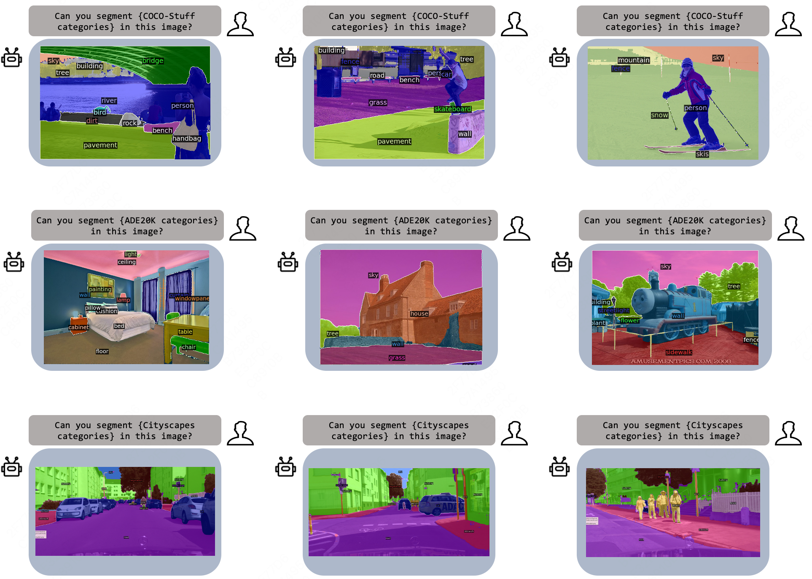
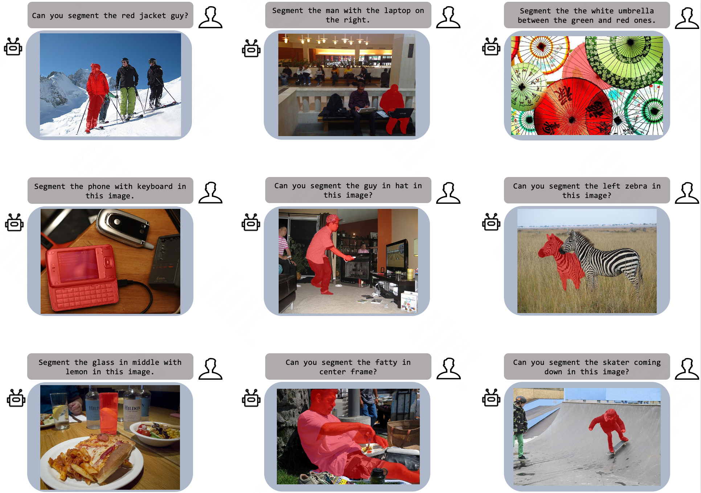
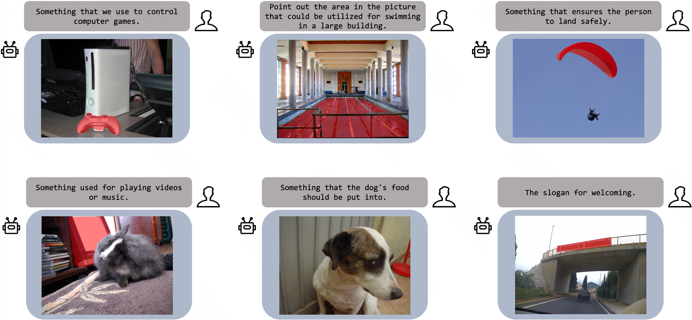
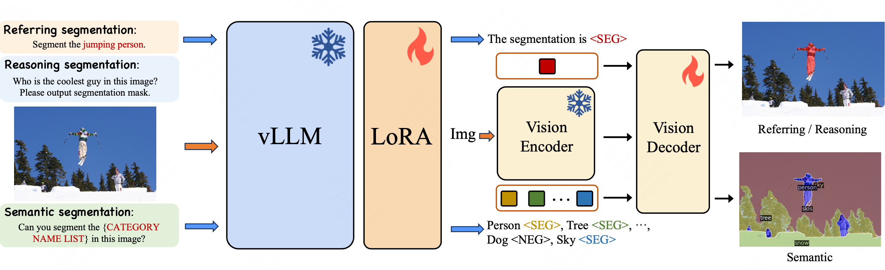

# LaSagnA: vLLM-based Segmentation Assistant for Complex Queries


<font size=7><div align='center' > <a href=https://arxiv.org/abs/2404.08506>**Paper**</a> | <a href="https://huggingface.co/weic22/LaSagnA-7B">**Models**</a></div></font>

<!-- <p align="center">  </p> -->

<p align="center">  </p>
<p align="center">  </p>
<p align="center">  </p>


## News
- [x] Release training and evaluation code.
- [x] Release LaSagnA-7B model weights.


## Abstract
Recent advancements have empowered Large Language Models for Vision (vLLMs) to generate detailed perceptual outcomes, including bounding boxes and masks. Nonetheless, there are two constraints that restrict the further application of these vLLMs: the incapability of handling multiple targets per query and the failure to identify the absence of query objects in the image. In this study, we acknowledge that the main cause of these problems is the insufficient complexity of training queries. Consequently, we define the general sequence format for complex queries. Then we incorporate a semantic segmentation task in the current pipeline to fulfill the requirements of training data. Furthermore, we present three novel strategies to effectively handle the challenges arising from the direct integration of the proposed format.The effectiveness of our model in processing complex queries is validated by the comparable results with conventional methods on both close-set and open-set semantic segmentation datasets. Additionally, we outperform a series of vLLMs in reasoning and referring segmentation, showcasing our model's remarkable capabilities.

## Highlights
1. We identify a crucial limitation of recent vLLM-based segmentation assistants. These assistants struggle with handling queries that involve multiple arbitrary targets, which may or may not exist in the image. To overcome this limitation, we introduce a sequence format that takes into account multiple classes and negative classes. With the proposed format, the assistant can be readily trained on semantic segmentation datasets. 
2. To address the challenges associated with the training on the semantic segmentation task, we present three innovative techniques: random classes list, sequence augmentation, and order following. By employing these strategies, the vLLM model can effectively utilize segmentation datasets, thus significantly improving its overall segmentation performance.
3. We conduct experiments on three distinct tasks and demonstrate the capability of the proposed model to handle complex queries. We reveal the potential of vLLM-based segmentation assistants in the fundamental perception task, namely, semantic segmentation. Moreover, we surpass a series of vLLMs in reasoning and referring segmentation. 


## Architecture
<p align="center">  </p>
Overview of LaSagnA. The vLLM generates a text response based on the instruction text and the input image. The vision encoder and decoder composite a standard SAM which is trained to predict multiple masks based on the textual embeddings generated by the vLLM. Besides, the vLLM also serves as classifier for complex query segmentation task to distinguish the positive categories from negative. We only finetune the vLLM using LoRA and train the decoder of SAM.

## Experimental results


## Installation
```
pip install -r requirements.txt
pip install flash-attn --no-build-isolation
```

## Training
### Training Data Preparation
Except for cityscapes and openimage datas, other training datas are the same with [LISA](https://github.com/dvlab-research/LISA).


```
├── dataset
│   ├── ade20k
│   │   ├── annotations
│   │   └── images
│   ├── coco
│   │   └── train2017
│   │       ├── 000000000009.jpg
│   │       └── ...
│   ├── cocostuff
│   │   └── train2017
│   │       ├── 000000000009.png
│   │       └── ...
│   ├── llava_dataset
│   │   └── llava_instruct_150k.json
│   ├── mapillary
│   │   ├── config_v2.0.json
│   │   ├── testing
│   │   ├── training
│   │   └── validation
│   ├── cityscapes
│   |   ├── gtFine
│   |   |   ├── cityscapes_panoptic_val.json
│   |   |   ├── train
│   |   |   └── val
│   |   └── leftImg8bit
│   |       ├── train
│   |       └── val
│   ├── OpenImageV6
│   |   ├── folder_train
│   |   ├── train-masks
│   |   └── train_mask.json
│   ├── reason_seg
│   │   └── ReasonSeg
│   │       ├── train
│   │       ├── val
│   │       └── explanatory
│   ├── refer_seg
│   │   ├── images
│   │   |   ├── saiapr_tc-12 
│   │   |   └── mscoco
│   │   |       └── images
│   │   |           └── train2014
│   │   ├── refclef
│   │   ├── refcoco
│   │   ├── refcoco+
│   │   └── refcocog
│   └── vlpart
│       ├── paco
│       │   └── annotations
│       └── pascal_part
│           ├── train.json
│           └── VOCdevkit
```

### Pre-trained weights

#### LLaVA
The training process needs loading LLaVA's pre-trained weights.
Specifically, we use the `LLaVA-Lightning-7B-v1-1` for our LaSagnA-7B model.
#### SAM ViT-H weights
The mask generator module requires loading SAM ViT-H weights [SAM](https://dl.fbaipublicfiles.com/segment_anything/sam_vit_h_4b8939.pth).

### Training
```
deepspeed --master_port=24999 train_ds.py \
  --version="PATH_TO_LLaVA" \
  --dataset_dir='./dataset' \
  --vision_pretrained="PATH_TO_SAM" \
  --vision_tower='PATH_TO_CLIP' \
  --dataset="sem_seg||refer_seg||vqa||reason_seg" \
  --exp_name="LaSagnA-7b" \
  --batch_size=2 \
  --model_max_length=1024 \
  --num_all_classes=80 \
```
When training is finished, to get the full model weight:
```
cd ./runs/LaSagnA-7b/ckpt_model && python zero_to_fp32.py . ../pytorch_model.bin
```

### Merge LoRA Weight
Merge the LoRA weights of `pytorch_model.bin`, save the resulting model into your desired path in the Hugging Face format:
```
CUDA_VISIBLE_DEVICES="" python merge_lora_weights_and_save_hf_model.py \
  --version="PATH_TO_LLaVA" \
  --weight="PATH_TO_pytorch_model.bin" \
  --save_path="PATH_TO_SAVED_MODEL"
```


### Validation
```
deepspeed --master_port=24999 test_sem.py \
  --version="PATH_TO_LaSagnA_MODEL" \
  --dataset_dir='./dataset' \
  --eval_only \
```


## Citation 
If you find this project useful in your research, please consider citing:

```
@article{****,
  title={LaSagnA: vLLM-based Segmentation Assistant for Complex Queries},
  author={****},
  journal={arXiv preprint arXiv:****},
  year={2024}
}
```

## Acknowledgement
-  Thanks for great works of [LLaVA](https://github.com/haotian-liu/LLaVA), [SAM](https://github.com/facebookresearch/segment-anything) and [LISA](https://github.com/dvlab-research/LISA). Our code is based on them.
